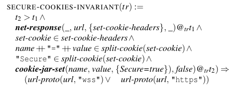

**Invariant I.1 – “Integrity of Secure cookies”**  
---

## 🧩 1. Mục tiêu bảo mật (Security Goal)

**Invariant I.1: “Integrity of Secure cookies”**

> *Cookies with the `Secure` attribute can only be set over secure channels.*

### ✅ Mục tiêu:
Đảm bảo rằng **cookie có gắn cờ `Secure` chỉ được tạo (Set-Cookie)** khi:
- Phản hồi HTTP được gửi qua **kênh an toàn (HTTPS)**.  
- Không được phép đặt (set) cookie `Secure` qua **HTTP không mã hóa**, vì điều này sẽ làm rò rỉ thông tin hoặc cho phép attacker trung gian (MITM) chèn cookie giả mạo.

👉 Nếu invariant này bị vi phạm, một trang HTTP (không an toàn) có thể ghi đè cookie `Secure` của trang HTTPS — gây tấn công **session hijacking** hoặc **downgrade cookie**.

---

## ⚙️ 2. Các sự kiện (Events) và thuộc tính (Predicates) liên quan

| Tên sự kiện | Mô tả |
|--------------|--------|
| `net-response(r)@tr_t1` | Sự kiện nhận phản hồi chứa header `Set-Cookie` tại `t_1`. |
| `cookie-jar-set(c)@tr_t2` | Sự kiện `lưu cookie` vào Cookie Jar tại `t_2` (do phản hồi t1 kích hoạt). |
| `url-proto(url, "wss" / "https")` | Hàm Logic: Kiểm tra giao thức URL (Lược đồ) có phải là an toàn hay không. |

---

## 🧮 3. Công thức logic bậc nhất (FOL Formula)

Invariant này được mô tả tương tự như trong [33] (Squarcina et al.), và trong bài Bernardo et al. nó được viết như sau (dạng khái quát):

---

## 🧠 4. Giải thích logic từng phần

| Thành phần | Ý nghĩa |
|-------------|----------|
| `t2 > t1` | Sự kiện lưu cookie (`cookie-jar-set`) phải xảy ra sau sự kiện nhận phản hồi (`net-response`). |
| `net-response(...)@tr_t1` | Nhận được phản hồi mạng `r` tại `t_1`. |
| `"Secure" ∈ split-cookie(set-cookie)` | Phản hồi đó chứa cookie được đánh dấu `Secure` trong header `Set-Cookie`. |
| `cookie-jar-set(...,{Secure=true},...)@tr_t2` | Trình duyệt thực sự lưu cookie Secure này vào bộ nhớ tại `t_2`. |
| `(url-proto(...) V url-proto(...))` | Kết luận bắt buộc: Giao thức của URL (url-proto) phải là `wss` HOẶC `https`. |

---

### 🧩 Diễn giải dễ hiểu:

> Nếu trình duyệt lưu một cookie có cờ `Secure` vào bộ nhớ, thì bắt buộc giao thức của URL đã thiết lập cookie đó phải là `HTTPS` hoặc `WSS`.

---

## 🔐 5. Ý nghĩa bảo mật thực tế

Invariant này đảm bảo rằng:
- Ngăn chặn Downgrade Attack (Tấn công hạ cấp): Kẻ tấn công không thể dùng một kết nối HTTP để cố tình thiết lập lại hoặc tạo ra cookie `Secure` giả mạo.
- Tính toàn vẹn của cờ Secure: Duy trì lời hứa bảo mật của cờ `Secure` xuyên suốt quá trình từ nhận header đến lưu trữ nội bộ.

---
